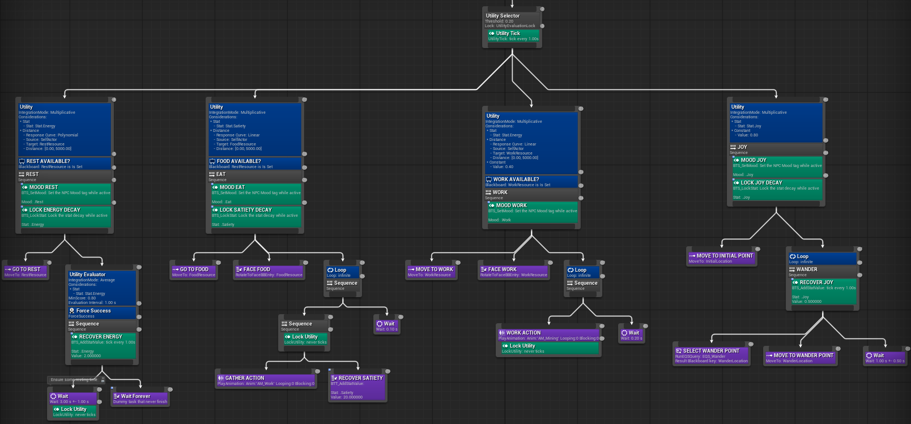
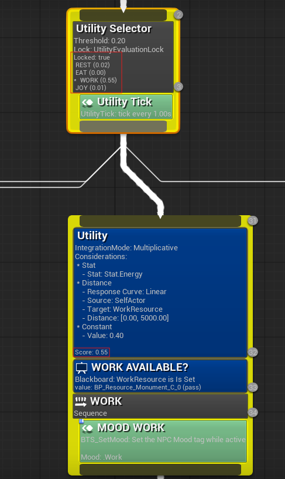
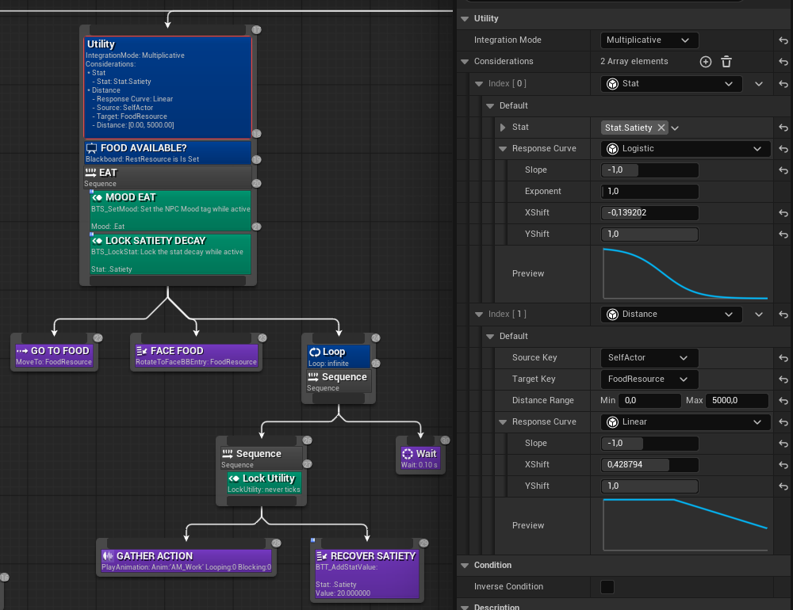

# BTUtility Sample Project

This repository is a functional basic demonstration of the **[BTUtility Plugin](https://github.com/ric-fm/BTUtility)** for Unreal Engine 5. It showcases an NPC agent capable of managing complex decision-making through a Utility-based AI system.

The project demonstrates how different behaviors are selected by balancing internal needs and environmental factors using a Utility Selector within a standard Behavior Tree.

---

## Project Showcase

[](https://www.youtube.com/watch?v=ZWR0MAHfQ_0)
*Click to watch the Utility AI in action: NPC balancing needs and real-time Behavior Tree simulation.*

---

## Agent Logic

The NPC agent evaluates and selects between different actions based on its current state:

### Available Actions
* **Work:** The agent moves to a resource node to gather materials.
* **Rest:** The agent returns to its house to recover.
* **Eat:** The agent searches for and moves to gather nearby food sources.
* **Joy:** The agent wanders around its spawn point.

### Decision Making

The selection process is driven by a combination of internal **Stats** (Energy, Satiety, Joy) and other **Considerations**.

The system uses a custom **Utility Selector** node that processes these inputs through configurable response curves to determine the most appropriate behavior at any given time.


*Behavior Tree Overview: Structure showing the different utility-driven branches.*

### Real-time Debugging
The plugin provides visual feedback directly on the Behavior Tree nodes. The Utility Selector lists all child scores and highlights the winning action.


*Runtime Debugging: The Utility Selector displaying calculated scores for each potential action.*

### Configuration and Considerations
Each action can be fine-tuned by combining multiple considerations. For example, the "Eat" task evaluates both the agent's hunger and the distance to food, using specific mathematical curves (Logistic, Linear, etc.) to normalize the input data.


*Implementation Detail: Multi-consideration setup for the "Eat" action with real-time curve previews in the editor.*

---

## Setup and Installation

This project utilizes **Git LFS** and **Git Submodules**. Follow these steps to ensure a correct installation:

### Requirements
- Unreal Engine 5.7+
- C++ Environment: A compatible C++ compiler and build tools (Visual Studio, Rider, etc.) are required to compile the project and the plugin.
- Git LFS: Must be installed on your system to retrieve binary assets.

### Clone the repository
- Use the `--recursive` flag to automatically include the BTUtility plugin:
```bash
git clone --recursive https://github.com/ric-fm/BTUtilitySample
```

- If the Plugins/BTUtility folder is empty, initialize and update the submodules manually:
```bash
git submodule update --init --recursive
```

- If Unreal assets are not loading correctly, ensure all large files are retrieved via Git LFS:
```bash
git lfs pull
```

## References:
- **Demo Video:** [Utility AI Showcase - YouTube](https://www.youtube.com/watch?v=ZWR0MAHfQ_0)
- **UtilityAI plugin:** [BTUtility](https://github.com/ric-fm/BTUtility)
- **Assets:** [Unreal Cropout Sample](https://www.unrealengine.com/en-US/blog/cropout-casual-rts-game-sample-project)
